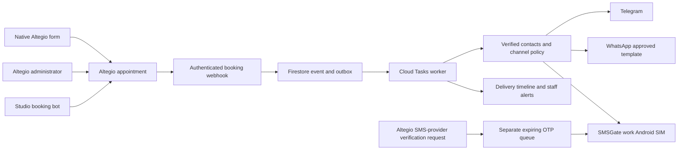

# Altegio notifications and studio bot

The native Altegio booking form remains the booking entry point. Extend its
supported settings and connect booking events to this service. The studio owns
the notification policy, templates, delivery history and staff controls.

## Current implementation boundary

The bot now receives the configured studio address, phone and visit information
before a booking exists. Its instructions and fixed replies use formal Armenian
and the studio's plural voice, avoid sales pressure, and prohibit hearts. A
delivery guard removes hearts before sending and storing a model reply. Staff
qualifications and discount conditions must come from verified studio sources;
availability is not evidence of experience or training.

`internal/application/notifications.Plan` calculates eligible Telegram,
WhatsApp and SMS targets. `internal/adapters/messaging/smsgate` sends one
transactional SMS and queries its status using the documented SMSGate API.
Both are tested foundations. **Neither is wired into gateway routes or the
production notification worker yet. No native form OTP or SMS is activated by
this change.** The Telegram staff conversation inbox is available; browser
administration of notification routing/delivery is still to be implemented.

## Architecture decision

Keep the existing Go modular monolith, Cloud Run, Firestore and Cloud Tasks.
Add a notification module with a durable outbox and authenticated workers.
Altegio remains the appointment authority; the language model never decides
where a verification code or booking notice is sent.

Use one Marketplace application for installation, branch authorization,
configuration and webhook registration. Expose an SMS-provider adapter only
after Altegio supplies and confirms its current request, authentication and
callback contract. Do not guess that wire schema from a support article.

## Booking notices and phone verification

| Message | Trigger | Routing | Success means |
| --- | --- | --- | --- |
| Booking created/changed/cancelled | Authoritative Altegio record change | Configured Telegram/WhatsApp order, then SMS | Provider accepted notice; track delivery separately |
| Reminder | Scheduled task; re-read appointment first | Same eligible-contact policy | Current appointment notice, not stale cancelled/moved details |
| Native browser login/booking code | Altegio SMS-provider request | SMS by default, high priority, source expiry | Code submitted for sending; preserve Altegio verification logic |

Booking notifications and native verification are separate flows. A record
creation webhook arrives too late to provide a login code. Redirecting native
codes to a messenger also requires a supported delivery hint in Altegio's form;
keep SMS until that behavior is confirmed. This preserves the requirement for
browser booking and native reviews without requiring the Altegio mobile app.

The default booking order is **Telegram → WhatsApp → SMS**. Administrators may
reverse the two messengers; SMS remains last. Skip disabled or ineligible
channels. Once a provider accepts a send, stop this attempt and track its result.
Only a definitive rejection/non-delivery can start fallback. A timeout or
ambiguous error enters reconciliation rather than an immediate duplicate send.
Never use lack of a read receipt alone as evidence of failed delivery.

Telegram eligibility requires a stored, verified association between the booking
phone and bot chat. A phone number, surname, username or display name alone
does not provide that association. A Telegram bot cannot initiate a conversation
with an arbitrary phone number. WhatsApp eligibility requires consent for that
phone and an approved template for the purpose and language. Do not use
unsolicited free-form messages as the fallback.

## Durable delivery and record synchronization

1. Validate the webhook bearer credential and installed branch before parsing
   an event. Persist the event and outbox entry atomically, then acknowledge it.
   Use `X-Hook-Id` for transport deduplication when supplied.
2. Re-read the current Altegio record. Webhooks can be repeated or arrive out of
   order. Compare the last notified semantic record snapshot; do not send stale
   changes just because an old webhook arrived.
3. Persist an immutable notification ID, purpose, record version, expiry,
   eligible target snapshot and attempt state before a provider call. Workers
   take transactional leases so concurrent tasks cannot send the same attempt.
4. Reconcile known provider message IDs after crashes or ambiguous responses.
   Accepted, sent, delivered, failed, expired and uncertain are distinct states.
   Dead-letter unresolved attempts for staff rather than retrying indefinitely.
5. Deduplicate bot-created confirmations against the corresponding Altegio
   event. A client must not get a chat confirmation and another identical
   booking-created notice merely because both paths observed the same record.
6. Keep appointment IDs separate from customer identities. Match a native
   record's contact to a verified contact link; preserve source-provided first
   name/surname when available. Never infer identity by splitting a display name.
7. Record delivery metadata for administrators. Mask phone numbers in broad
   log views and restrict transcript access. Do not log/store OTP text in the
   conversation timeline or diagnostic logs. Keep code payloads only as long as
   required for the authenticated provider handoff, then delete them.

Staff-created and form-created bookings use the same notification policy.
Keep the true creation source for audit and template context. The administrator
controls notification behavior; this does not change a client booking into a
staff-created booking. Notifications speak for the studio and are distinct from
internal Telegram staff alerts.

## Android SMSGate

Use the dedicated work Android phone with SIM **+37494768067**. The adapter
requires explicit device ID and SIM number, rather than selecting a random
registered device. The API cannot set that phone number as an arbitrary sender:
the installed SIM supplies it.

The constructor accepts the full API prefix:

- Public mode: `https://api.sms-gate.app/3rdparty/v1`.
- Private mode: `https://sms.STUDIO-DOMAIN/api/3rdparty/v1`.

Store device credentials in Secret Manager. Prefer a private SMSGate relay when
operationally ready, with TLS, its own database and monitoring. It is a separate
stateful service; do not embed it in the scale-to-zero bot container. Public
remote mode can be used for a controlled pilot without exposing the phone's
local server to the internet. No relay is deployed by this change.

The client uses `textMessage.text`, E.164 recipients, explicit `validUntil`,
delivery reports and stable IDs. It does not automatically retry POST requests.
HTTP 409 means the ID may already exist and requires status reconciliation.
Normal notices use priority 0; expiring verification codes use priority 100,
with expiry from Altegio's verified contract. Measure multipart Armenian SMS
usage: several segments can incur several carrier SMS charges. Phone sending
does not guarantee lower cost until the SIM tariff and expected volume are known.

SMSGate `Sent` is SMSC acceptance, not delivery. Its multipart `Delivered` state
may be emitted after any part is delivered, so it is not proof that a client
received the entire message. Retain that distinction in the staff timeline and
Altegio callback mapping. Callback fees/currency/parts must use the negotiated
provider contract; never invent a fee or report queue acceptance as delivery.

Sent and received messages are visible in Android's default SMS application.
An administrator can therefore see them on the phone. A manual phone reply
does not automatically synchronize with the cloud inbox: inbound SMS/webhook
capture and manual-reply reconciliation are additional work. Initially route
incoming SMS to staff; do not activate autonomous SMS conversations as a side
effect of enabling transactional SMS.

Commissioning requires checking the real device/SIM, permissions, background
operation, expiry during an offline interval, delivery reports, and a controlled
round trip with a studio-owned test number. Add phone-offline, queue-age and
failure alerts. Failed OTPs must not be sent hours later when the phone returns.

## Native form and account ownership

Altegio's supported Last Name field was enabled for branch **1389810** on
5 October 2026 and verified on the public booking form after refresh. It is
optional; name and phone remain required. The hosted form renders Last Name
before Name, followed by phone, email and comment.
Keep name, surname, phone and notification preference clear and concise.
Individual field reordering and an arbitrary channel selector in the hosted
form have not been confirmed. Use a supported redirect/companion page for bot
linking and preferences if the native form cannot display them. Do not claim
the Marketplace app can inject arbitrary HTML into Altegio's hosted form.

Chrome inspection corrected the earlier app identification: **2397** is
Altegio Pro MCP, not the studio bot application. The working backend's legacy
developer credentials belong to the legacy integration. The replacement app
does not change appointment or customer IDs; it restores access independently
of the inaccessible developer registration.

A new developer account **2830**, E-Motion Concept, was registered under
Garik's accessible login on 5 October 2026. Private app **2554**,
E-Motion Concept Notifications (`emotionconceptnotifications`), was created
in the SMS aggregators category with SMS, WhatsApp and Telegram metadata.
It remains unpublished publicly but is installed and **active** in branch
1389810. Its system user has booking, client contact, surname, catalogue and
message-detail permissions. Finance, payroll, inventory and user administration
are excluded. New credentials passed `companies?my=1`, private `records`,
`book_services` and `book_staff` checks. The old cloud credentials returned 403
for private records. Cloud Build switches the pair together using separate,
pinned version-1 Secret Manager entries for app 2554; prior revisions retain
their original bindings for rollback.

This API connection does not activate message delivery. SMS provider credentials,
sender selection and provider endpoints remain unset. Native SMS and WhatsApp
delivery are not connected; email and the administrator app remain active.
The form now displays truthful country-code guidance without claiming that
messenger/SMS verification is already running. Altegio support ticket
**141720495** covers the provider contract and native field order/localization.

Request restoration of the legacy developer registration if needed. Test the
replacement branch authorization and notifications before switching. Keep the
working backend operational until cutover, then retire old credentials and
reconcile native records. Do not change appointment identities during migration.

## Remaining implementation and acceptance gates

- Backend credential cutover to app 2554 is complete: the deployed pair was
  compared privately and company, private record, service and staff reads passed
  on 5 October 2026. Retain prior revision bindings for rollback.
- Obtain the exact Altegio SMS-provider contract and callback credentials.
- Implement authenticated webhook ingestion, Firestore outbox, worker leases,
  provider adapters, reconciliation, callbacks and self-booking deduplication.
- Build authenticated administrative settings, delivery timeline, staff controls
  and verified Telegram linking. Preserve verified consent and language choices.
- Validate native browser verification/reviews after the SMS provider is activated.
- Install/register SMSGate and validate the work SIM before sending real clients.
- Supply approved staff biographies and actual discount conditions so the bot
  can answer those questions without unnecessary handoffs.

Accept only after exercising form-created and staff-created bookings; messenger
eligibility; both messenger priority orders; SMS-only clients; blocked chats;
provider timeouts; duplicate/out-of-order webhooks; cancellation/rescheduling;
offline-phone expiry; callback reconciliation; and a browser login/review using
the native form. Use studio test recipients and label synthetic data clearly.

## Primary documentation

- [Altegio webhooks](https://developer.alteg.io/en/developers/openapi/webhooks)
- [Altegio SMS aggregator onboarding](https://alteg.io/en/support/knowledge-base/6746468657949/)
- [Altegio native form fields](https://alteg.io/en/support/knowledge-base/4903499358237-setting-online-booking/)
- [Altegio Marketplace placement](https://alteg.io/en/support/knowledge-base/6745848593181-step-by-step-guide-to-placement-in-the-marketplace)
- [Telegram bots](https://core.telegram.org/bots)
- [WhatsApp Business policy](https://whatsappbusiness.com/policy/)
- [SMSGate sending](https://docs.sms-gate.app/features/sending-messages/)
- [SMSGate status semantics](https://docs.sms-gate.app/features/status-tracking/)
- [SMSGate phone visibility](https://docs.sms-gate.app/faq/general/)
- [SMSGate private server](https://docs.sms-gate.app/getting-started/private-server/)
